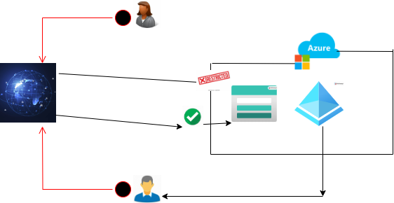
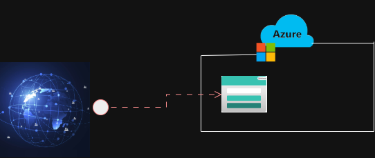

# Secure-Document-Management-System-
To enhance data security, organizations may choose to encrypt data using Customer Managed Keys (CMK), allowing full control over the encryption process. To further strengthen the security of data stored in this storage account, the public endpoint has been disabled, permitting access only to devices within the virtual network connected through the private endpoint of the storage account.
Watch the demo video: https://youtu.be/lzVobwZfDWM

.png>)

Based on organizational requirements, storage accounts can be configured to disallow anonymous access, ensuring that only authorized users can access the storage account. I have implemented Role-Based Access Control (RBAC) to grant access exclusively to authorized users via Microsoft Entra ID.
Watch the demo video: https://youtu.be/uF4MkTB7Qy0

This storage account is publicly accessible, allowing anyone to access the blobs stored within it via the appropriate Shared Access Signature (SAS) or blob endpoint. This type of storage is recommended for less sensitive information since its public endpoint is exposed to the internet.
Watch the demo video: https://youtu.be/8J4xWHZWcQ0

